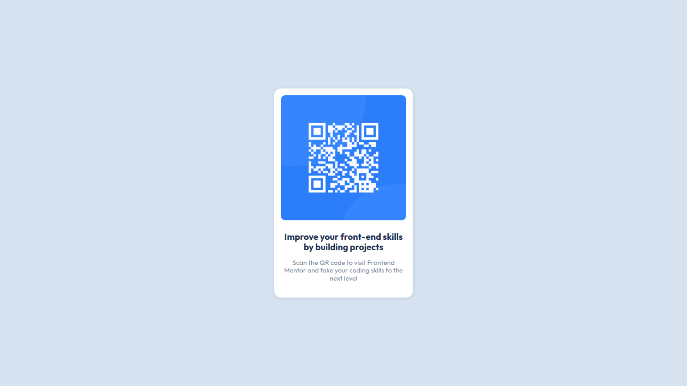

## QR code component

This is a solution to the [QR code component challenge on Frontend Mentor](https://www.frontendmentor.io/challenges/qr-code-component-iux_sIO_H). Frontend Mentor challenges help you improve your coding skills by building realistic projects. 

## Overview

### The challenge

Users should be able to:

- View the optimal layout depending on their device's screen size

### Screenshot

### Links

- Live Site URL: [QR code component](https://migueweb.github.io/qr-code-component)

## My process

### Built with

- Semantic HTML5 markup
- Normalize CSS
- CSS custom properties
- Flexbox
- Mobile-first workflow

## Author
Miguel Amador
- Github: [@migueweb](https://github.com/migueweb)
- Frontend Mentor: [@migueweb](https://www.frontendmentor.io/profile/migueweb)

